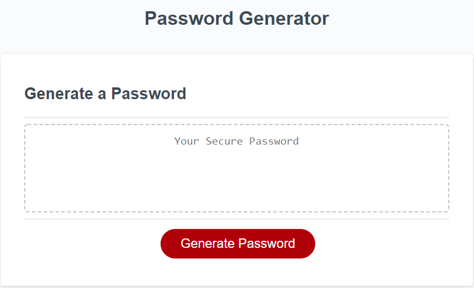

# Password Generator (Homework-03)

## Description

This webpage generates a password based off criteria entered by the user. I was given the webpage layout and styling, as well as the JavaScript code to insert the generated password, and I wrote the JavaScript function ```generatePassword()```.

[Deployed here on Github Pages](https://johndjake.github.io/password-generator/).


## Usage

Click on the generate password button and follow the prompts.




## Credits

The webpage layout and styling was given to me by Trilogy Education Services as a homework assignment.


## License

The design of this webpage is copyrighted by Trilogy Education Services.